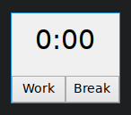
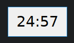

# pomodoro-rs-fltk
Minimal pomodoro timer written in Rust

It is meant to stay on top of the screen at all times to remind you of the current pomodoro session.  
Therefore it was designed to be as minimal as possible.  
You should use another tool to set it as "Always on Top."  

It also shows the amount of completed sessions in the window title. (not shown in the screenshots)

